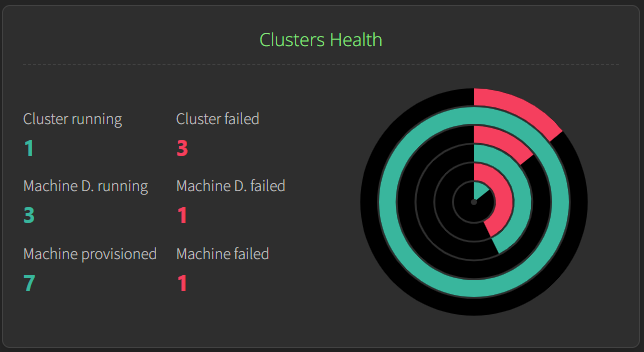
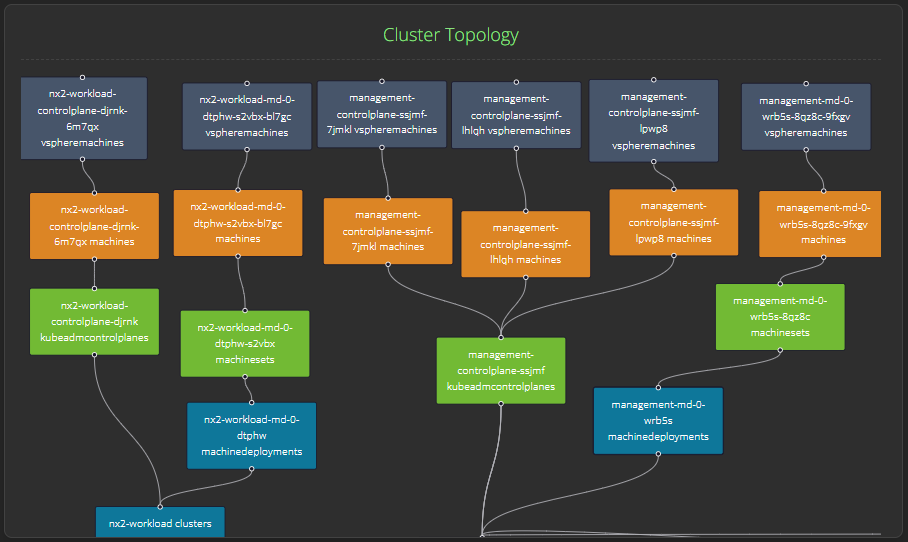
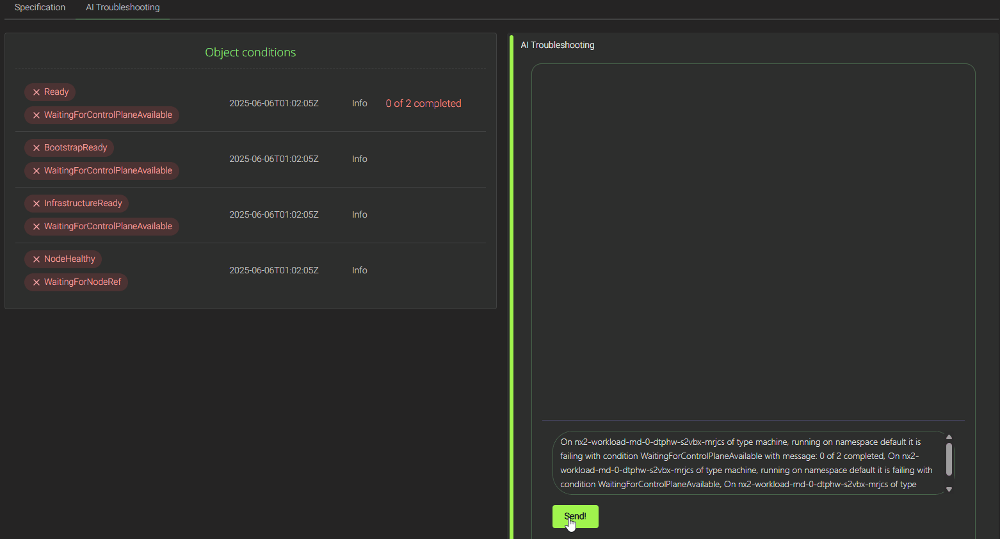
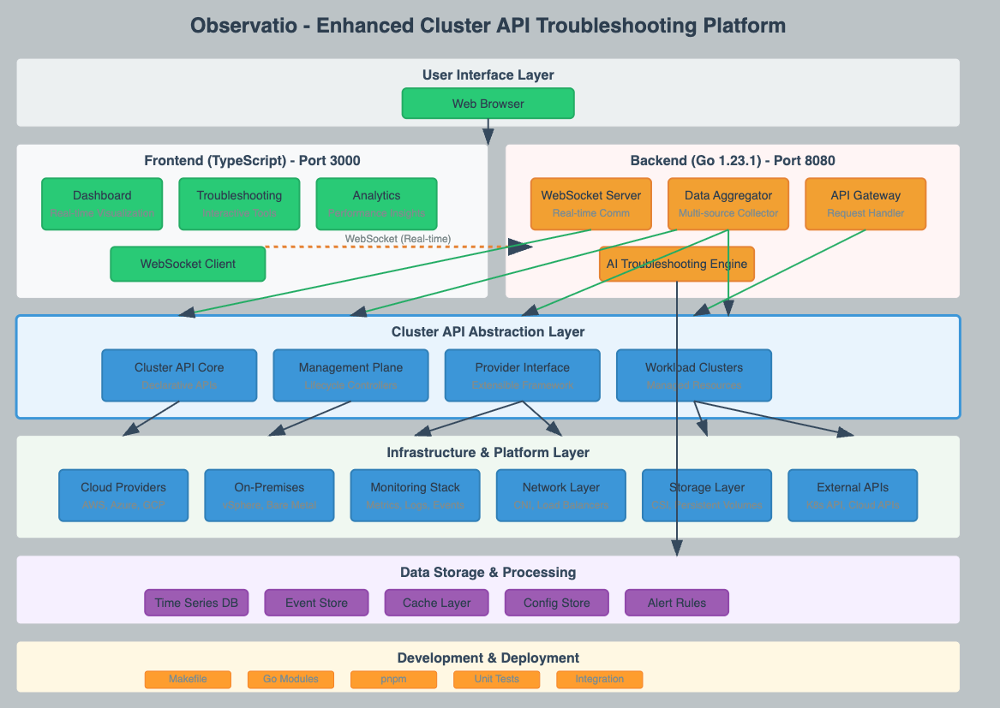

# Observātiō - Smart ClusterAPI Troubleshoot Platform

[](https://github.com/knabben/observatio/actions/workflows/build.yml)

<p align="center">

</p>

The project focuses on monitoring Kubernetes clusters managed ty [ClusterAPI](https://cluster-api.sigs.k8s.io/), 
providing tools and solutions to enhance visibility and efficiency. By collecting and consolidating data from diverse sources, 
it offers comprehensive insights into cluster performance and health. Equipped with advanced dashboards and real-time visualization, 
the project enables users to swiftly identify and address issues, improving operational reliability and reducing downtime. 
This solution empowers organizations to maintain optimal cluster functionality, streamline troubleshooting efforts, 
and ensure robust management of their cloud-native environments.

## The Cluster Dashboard

### Health Status

<p align="center">

</p>

The cluster health screen serves as a centralized dashboard for monitoring the operational status of your entire vSphere Cluster API environment, 
presenting both quantitative metrics and visual health indicators in an at-a-glance format. 
This view is crucial for vSphere administrators as it aggregates health data across multiple layers - from cluster-level availability down to individual machine lifecycle states 

The accompanying circular health visualization provides an intuitive radial representation where each ring corresponds to different infrastructure layers, with green segments indicating healthy components and red segments highlighting problematic areas that require immediate attention. 
For vSphere environments, this health summary is particularly valuable during troubleshooting scenarios, as it allows operators to quickly identify whether issues are isolated to specific machine provisioning problems 
(potentially vSphere resource constraints) or represent broader cluster-wide failures that might indicate management plane issues, 
networking problems, or underlying vSphere infrastructure degradation affecting multiple workload clusters simultaneously.

### ClusterAPI Topology


<p align="center">

</p>

The topology screen provides a comprehensive visual representation of your vSphere-based Cluster API infrastructure, displaying the hierarchical relationships
between management and workload clusters as interconnected nodes. In the context of vSphere monitoring, this view is particularly valuable as it shows the real-time
status and dependencies between different cluster components - from the top-level management cluster down to individual machine deployments and their underlying vSphere virtual machines.
The color-coded boxes (blue for infrastructure components, orange for control plane elements, green for worker nodes, and teal for deployments) allow administrators to quickly 
identify the health and operational state of each component, making it easier to trace issues from the Kubernetes layer down to the vSphere infrastructure. 

This topology visualization is essential for debugging scenarios where problems might cascade through the stack - for instance, if a vSphere datastore issue affects specific machines,
you can immediately see which workload clusters and applications are impacted by following the connection lines between the affected infrastructure components and
their dependent resources.

## Intelligent Troubleshooter

### Scenario - Machine Bootstrap Failure Investigation

**Problem**: A Kubernetes operator notices that a worker node machine *nx2-workload-md-0-dtphw-s2vbx-bl7gc* has been stuck in a failing 
state for 25 minutes and is unable to join the cluster. The machine shows a red error indicator and multiple failed conditions, 
but the root cause is unclear from basic cluster monitoring.

**Available Information**: The operator has access to the machine's object status conditions, which reveals a cascade 
of failure states including :

- "Ready" (failed)
- "WaitingForControlPlaneAvailable" (with message "0 of 2 completed")
- "BootstrapReady" (failed)
- "InfrastructureReady" (failed)
- "WaitingForNodeRef" (failed). 
- 
All conditions show the same timestamp, indicating they occurred simultaneously during the bootstrap process.

**AI Troubleshooting Integration**: The dashboard's AI troubleshooting feature analyzes these interconnected failure conditions and provides intelligent diagnosis, 
identifying that the primary issue stems from the control plane not being fully available ("0 of 2 completed" message), which prevents the worker node from 
completing its bootstrap sequence. 

<p align="center">

</p>

The AI assistant explains that the machine deployment is waiting for at least 2 control plane nodes to be ready before proceeding, 
suggesting this is likely a control plane scaling issue rather than a worker node-specific problem. 

This automated analysis helps the operator quickly pivot from investigating worker node issues to examining control plane availability 
and scaling configurations, significantly reducing mean time to resolution in complex vSphere Cluster API environments.

## Running the project

## Building and Running

### Prerequisites

- Go 1.23.1
- Node.js and pnpm
- Linux and Make

## Production

Ensure your management cluster is accessible via `${HOME}/.kube/config` compile the bundled frontend in the go binary 
and run the server.

```bash
make build && ./output/observatio serve
```

Both API and frontend are accessible via port TCP 8080.

## Development

### Backend Setup

1. Install backend dependencies:

   ```bash
   cd webserver
   go mod tidy
   ```

2. Build the backend webserver job:
   ```bash
   make run-backend what=serve
   ```

3. Running unit tests
   ```bash
   make run-tests-backend
   ```

The backend server will start and listen for WebSocket connections. By default, it runs on port 8080.

### Frontend Setup

1. Install frontend dependencies:
   ```bash
   cd front
   pnpm install
   ```

2. Run the development server:
   ```bash
   make run-frontend
   ```

3. Run tests for the frontend:
   ```bash
   make run-tests-frontend
   ```
 

The frontend development server will start and be available at http://localhost:3000.


## Architecture Diagram

