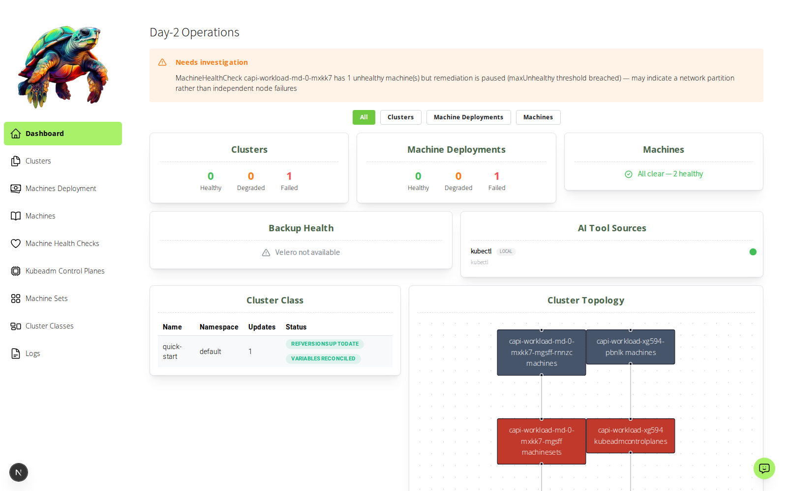
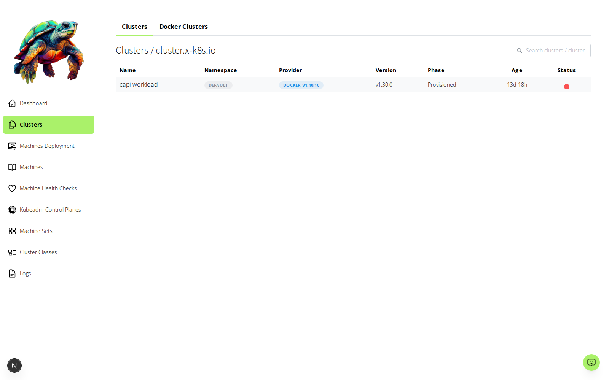
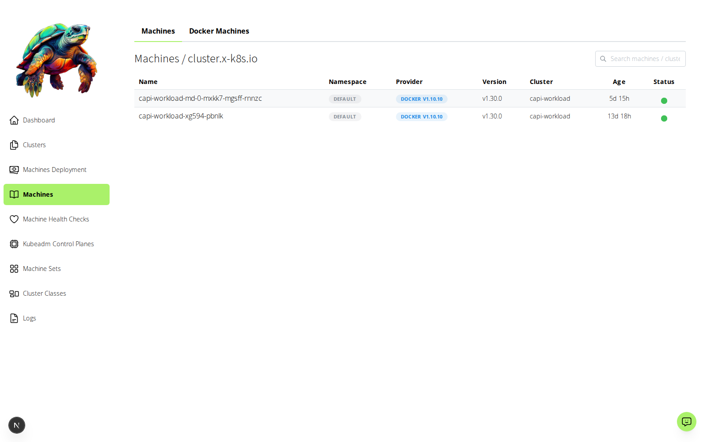
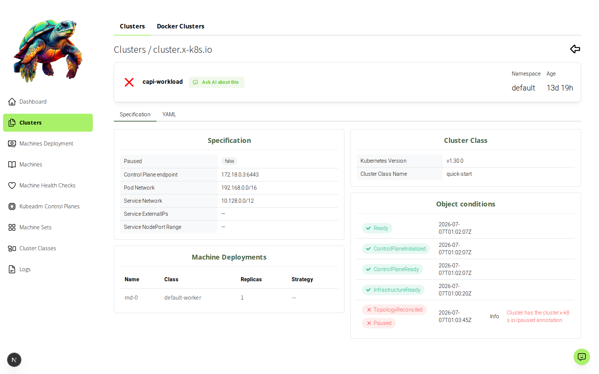
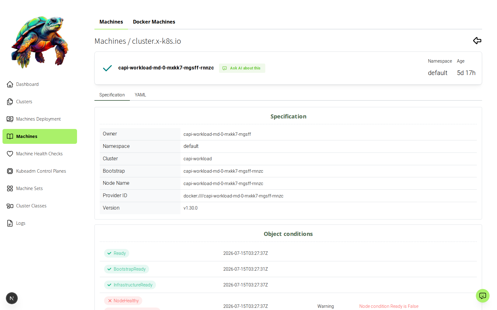
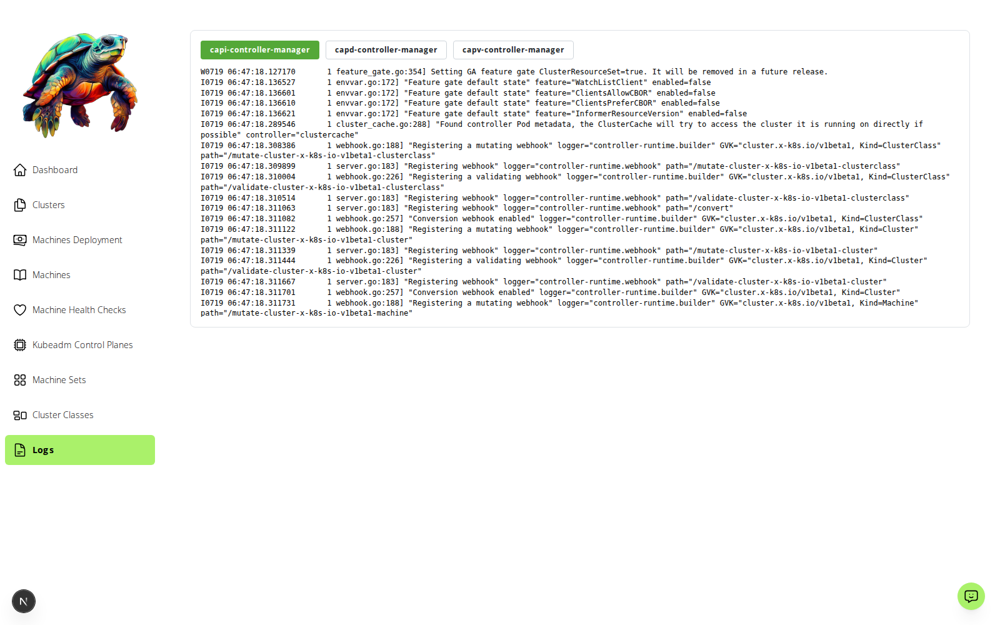
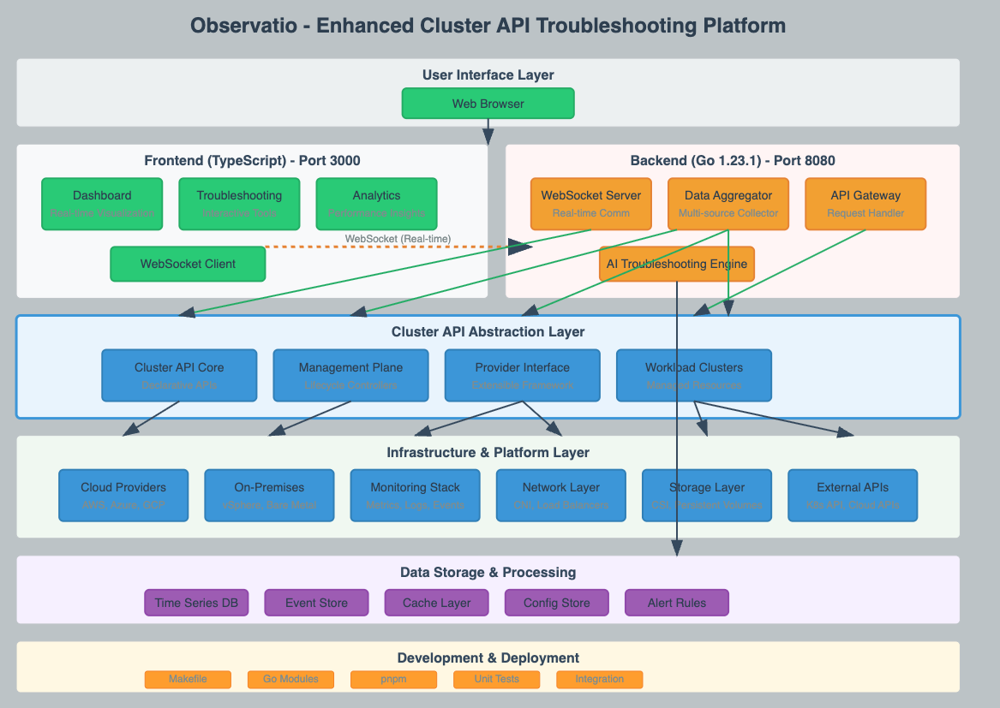

# Observātiō - Smart ClusterAPI Troubleshoot Platform

[](https://github.com/knabben/observatio/actions/workflows/build.yml)

<p align="center">

</p>

Observātiō is a single dashboard for operators running [Cluster API](https://cluster-api.sigs.k8s.io/)-managed
Kubernetes clusters. It watches Clusters, Machines, MachineDeployments, MachineSets, KubeadmControlPlanes,
MachineHealthChecks, and ClusterClasses in real time, rolls their health up into one Day-2 Operations view, and lets
an AI assistant investigate a failure by running read-only `kubectl` (and any aggregated MCP tool) against the
management cluster on the operator's behalf. It ships as a single Go binary embedding a Next.js/Mantine frontend,
talking to the management cluster's Kubernetes API and streaming resource state over WebSockets.

## Day-2 Operations dashboard

<p align="center">

</p>

The landing page is a live rollup, not a list of links: healthy/degraded/failed counts per resource category
(Clusters, Machine Deployments, Machines), a "Needs investigation" banner surfacing the single highest-severity
issue across the environment, Velero backup health (reachability + recovery-point-objective staleness per cluster),
the aggregated AI tool sources currently available to the assistant, and the Cluster Topology / Cluster Class views
retained from earlier iterations of the dashboard.

## Resource browsing

<p align="center">


</p>

Each Cluster API resource kind (Clusters, Machines, Machine Deployments, Machine Sets, Kubeadm Control Planes,
Machine Health Checks, Cluster Classes) gets its own live-updating table — namespace, provider, version, phase, and
a status dot driven by the same tri-state health semantics used across the dashboard, never a one-off color pick.

## Resource detail & AI hand-off

<p align="center">


</p>

Selecting any row drills into that object's full detail view: spec fields, related child resources (a Cluster shows
its Machine Deployments; a Machine shows its owner and provider ID), the raw YAML, and the timestamped chain of
status conditions — the same signal an operator would otherwise read off `kubectl describe`. Every detail view also
carries an **Ask AI about this** button that opens the AI Troubleshooting panel already pre-filled with that
specific object's context, so investigating a failure never starts from a blank prompt.

## Live controller logs

<p align="center">

</p>

The Logs view tails the CAPI, CAPD, and CAPV controller-manager pods directly from the management cluster, so an
operator doesn't need `kubectl logs -f` in a separate terminal while triaging a failure in the dashboard.

## AI Troubleshooting

<p align="center">

</p>

The AI panel is a live agent, not a canned lookup: asked why a cluster isn't ready, it drives real, read-only
`kubectl` calls against the management cluster — inspecting the Cluster, its KubeadmControlPlane, and its
MachineDeployment/MachineHealthCheck status — before answering with the specific condition chain that explains the
failure and a concrete remediation sequence. Tool access is pluggable: the built-in `kubectl` capability runs
in-process as a local MCP server, and additional external MCP tool sources can be aggregated alongside it (see
`specs/009-mcp-server-client-aggregator`), so the assistant's available tools grow without changing how it's asked
a question.

## Building and Running

### Prerequisites

- Go 1.24
- Node.js 22 (LTS) and pnpm
- Linux and Make

## Releases

Pre-built binaries are published automatically on each version tag push.
Download the latest from the [Releases page](../../releases) — assets are named
`observatio-<version>-linux-amd64` (e.g. `observatio-v1.0.0-linux-amd64`).

```bash
chmod +x observatio-v1.0.0-linux-amd64
./observatio-v1.0.0-linux-amd64 serve
```

## Production

Ensure your management cluster is accessible via `${HOME}/.kube/config`, compile the
bundled frontend into the Go binary, and run the server.

```bash
make build && ./output/observatio serve
```

Both API and frontend are accessible via port TCP 8080.

## Development

### Backend Setup

1. Install backend dependencies:

   ```bash
   cd webserver
   go mod tidy
   ```

2. Build the backend webserver job:
   ```bash
   make run-backend what=serve
   ```

3. Running unit tests
   ```bash
   make run-tests-backend
   ```

The backend server will start and listen for WebSocket connections. By default, it runs on port 8080.

### Frontend Setup

1. Install frontend dependencies:
   ```bash
   cd front
   pnpm install
   ```

2. Run the development server:
   ```bash
   make run-frontend
   ```

3. Run tests for the frontend:
   ```bash
   make run-tests-frontend
   ```
 

The frontend development server will start and be available at http://localhost:3000.

### Environment variables (development only)

In production, the frontend is embedded in and served by the same Go binary as the API/WebSocket,
so it addresses them **same-origin** (derived from `window.location`) with no configuration needed.
The `NEXT_PUBLIC_*` variables below exist only to support running `pnpm run dev` (frontend on
`:3000`) against a separately-running backend (`:8080`); leave them unset for `make build` /
`make verify-binary` and the embedded production binary. See `front/.env.example`.

| Variable | Purpose | Default when unset |
|----------|---------|---------------------|
| `NEXT_PUBLIC_API_URL` | REST API base URL | same-origin (`''`) |
| `NEXT_PUBLIC_WS_URL` | Live resource watcher WebSocket URL | `ws(s)://<origin>/ws/watcher` |
| `NEXT_PUBLIC_WS_URL_CHATBOT` | AI troubleshooting WebSocket URL | `ws(s)://<origin>/ws/analysis` |

### AI assistant configuration

The AI Troubleshooting panel needs an Anthropic API key with an available credit balance. The
Go SDK client (`anthropic.NewClient()`) reads it straight from the process environment — there is
no `.env` auto-loading in the backend, so export it into the shell that runs `serve`/`run-backend`:

```bash
export ANTHROPIC_API_KEY=sk-ant-...
# optional: pin a specific model instead of the compiled-in default
export ANTHROPIC_MODEL=claude-sonnet-5
```

Without a valid key/balance, the rest of the dashboard works normally — the panel just replies
that the AI assistant isn't available and to check the server's AI configuration.

### Velero backup health

The Day-2 Ops dashboard's Backup Health card (spec `008-velero-backup-recoverability`) checks for the
`backups.velero.io` CRD on connection; when it's absent the card just reports "Velero not available" and every
other feature keeps working normally. To see it populated with real coverage/RPO data locally, install
[Velero](https://velero.io/) against your management cluster with any S3-compatible backend — for a `kind`
cluster with no cloud storage handy, a local MinIO container on the same docker network works:

```bash
# 1. Run MinIO on the kind network so cluster pods can reach it by container name
docker run -d --network kind --name minio -p 9000:9000 -p 9001:9001 \
  -e MINIO_ROOT_USER=minioadmin -e MINIO_ROOT_PASSWORD=minioadmin \
  minio/minio server /data --console-address :9001

# 2. Create the bucket Velero will write to
docker run --rm --network kind --entrypoint /bin/sh minio/mc -c \
  "mc alias set myminio http://minio:9000 minioadmin minioadmin && mc mb myminio/velero"

# 3. Install Velero against it
cat > credentials-velero <<'EOF'
[default]
aws_access_key_id = minioadmin
aws_secret_access_key = minioadmin
EOF

velero install --provider aws --plugins velero/velero-plugin-for-aws:v1.9.0 \
  --bucket velero --secret-file credentials-velero --use-volume-snapshots=false \
  --backup-location-config region=minio,s3ForcePathStyle=true,s3Url=http://minio:9000 --wait

# 4. Take a backup so the card has an actual recovery point to report
velero backup create demo-backup --include-namespaces default --wait
```

Once `kubectl get backupstoragelocation -n velero` shows `Phase: Available` and `velero backup get` shows
`demo-backup` as `Completed`, the dashboard picks both up on its next watch tick — no restart needed.

### Verifying the single-binary build

`make verify-binary` builds the full stack, launches `output/observatio` on a throwaway port, and
asserts the UI root and an unknown client route both serve the embedded SPA shell (200) and a live
API route responds — all on one origin — then tears the process down. A non-zero exit means the
embed or SPA fallback is broken.

```bash
make verify-binary
```

## Architecture Diagram

